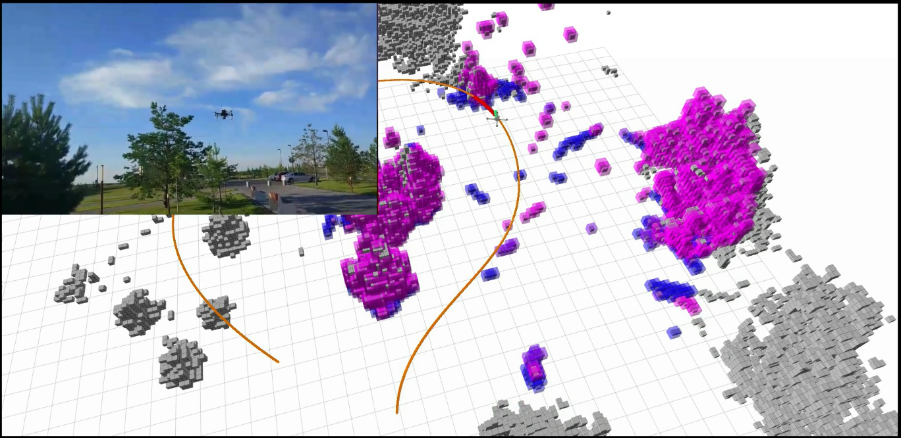
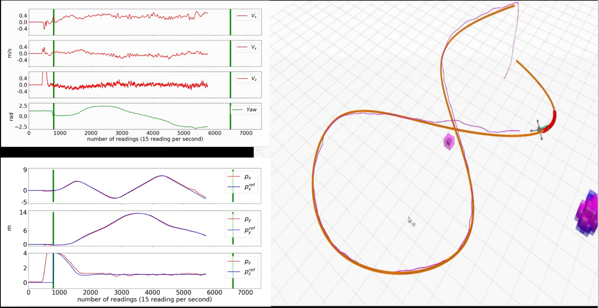
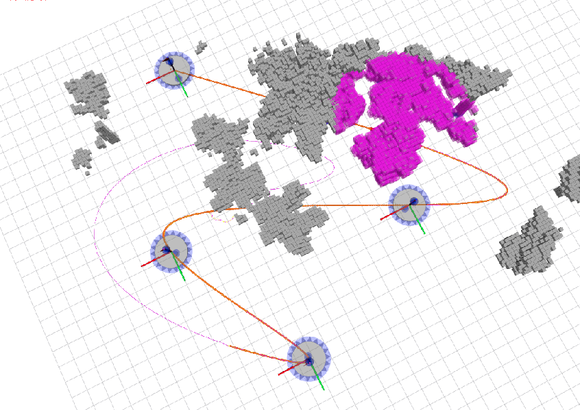

## The code will be avaible after the publication is accepted 

# Trajectory-Tracker 

__Authors__: Geesara Kulathunga, Dmitry Devitt, Roman Fedorenko and Alexandr Klimchik

<p align="center">
  
  
  
  
</p>

Complete videos: 
[Field experiment 1](https://www.youtube.com/watch?v=qYtWrFvxiOI),
[Field experiment 2](https://www.youtube.com/watch?v=myRPkKTRlJU), 
[Simulator test](https://www.youtube.com/watch?v=Umts9k9f-Lk), [Checking tracking accuracy in a real flight test](https://youtu.be/1yRYbTryKnQ). 

## Table of Contents

* [Prerequisites](#Prerequest)
* [Building with ROS](#2-Building-with-ROS)
* [Running the Trajectory Tracker](#3-Running-the-Trajectory-Tracker)
* [Test dataset](#4-test-dataset)

## 1. Prerequisites 

The project is developed and tested on Ubuntu 18.04, ROS Melodic for DJI and PX4. Following external libaries are needed before running trajectory tracker 

Installing CasADi and IPOPT 
```
  https://github.com/casadi/casadi/wiki/InstallationLinux  
```
Installing CNPY 
```
https://github.com/rogersce/cnpy
```
Installing PX4
```
https://docs.px4.io/master/en/config/firmware.html
```

## 2. Building with ROS

Once you installed all the prerequisites, clone this repository to the catkin workspace and try to build 

```
  cd ${YOUR_WORKSPACE_PATH}/src
  git clone https://github.com/GPrathap/trajectory-tracker.git
  cd ../
  catkin build
```

## 3. Running the trajectory tracker 

##### To start Gazebo with necessary components 
   ``roslaunch drone_sim task_3.launch``
  
##### For arming and chaging the controlling mode 
``roslaunch state_machine take_off.launch``

##### This will launch trajectory tracker and Rviz 
``roslaunch state_machine px4_fsm_trajectory_tracker.launch``

##### Finally, to send controlling command to quadrotor
``roslaunch state_machine px4_reg.launch``

## 4. Test dataset 

``waypoints_all.csv`` files which located at ``hagen_planner/state_machine/data/`` consists of 100 different paths. Each of those paths is discribed by a set of waypoints, i.e., 4 to 16. Start and end waypoint are guranteen not to be within the obstacles. On the other hand, intermediate waypoints cloud be inside or partically within the obstacles. In order to generate the octomap and point cloud of a simulated world in Gazebo you may use [this script](https://github.com/GPrathap/forest_gen/blob/master/genForests_WithoutWorld.sh) in [this repo](https://github.com/GPrathap/forest_gen). Each row of ``waypoints_all.csv`` is expressed in the following format:

``path_id, world_number, waypoint_1_x, waypoint_1_y, waypoint_1_z, ..., waypoint_n_x, waypoint_n_y, waypoint_n_z``

Some of the example trajectories:

<p align="center">
  
  
  
  
</p>


